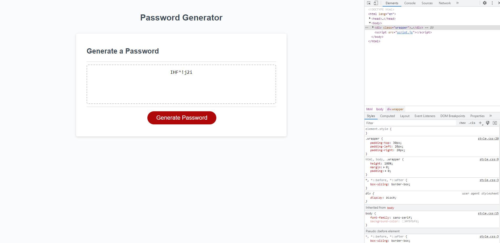

# 03 JavaScript: Password Generator

## Project Summary

The goal of this assignment was to create a password generator that utilizes functions, arrays, and if/else statements in Java Script. 

[Click here to see my Password Generator.](https://christopherrclark.github.io/password-generator/)

